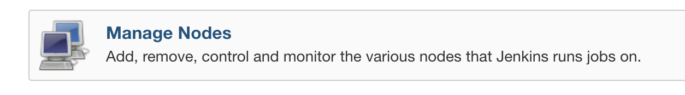
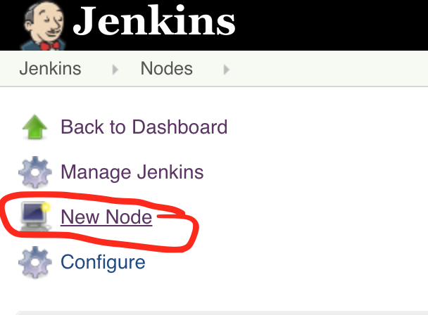
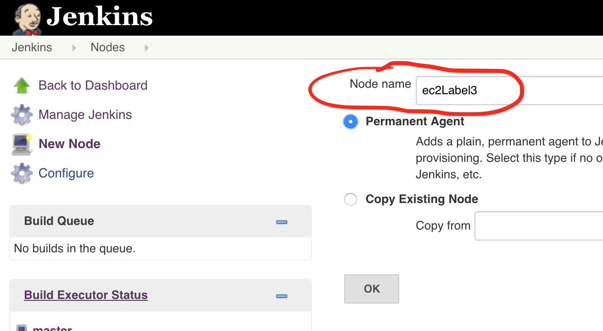
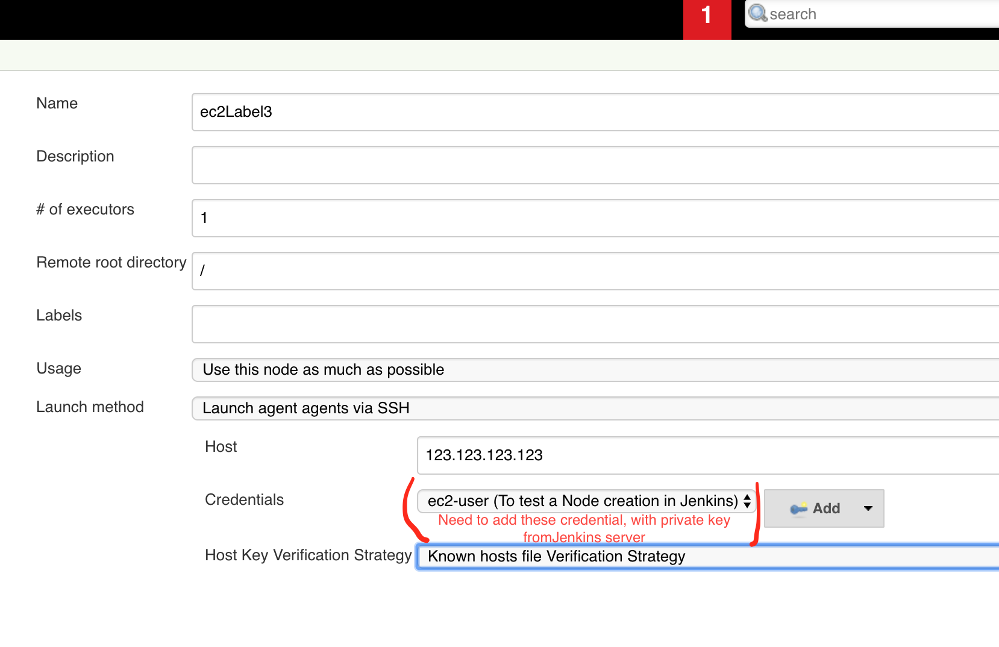
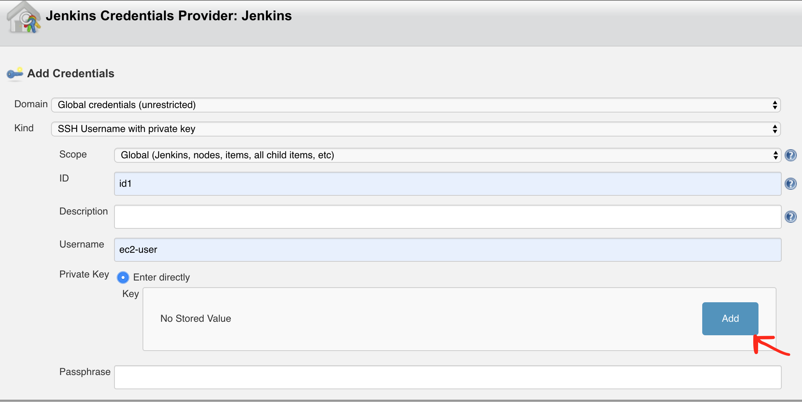
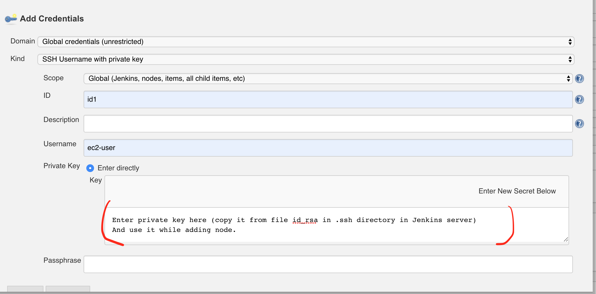
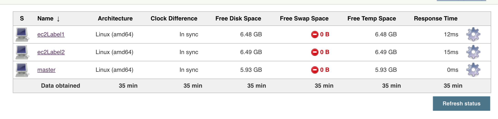

# Jenkins installation and configuration.

---------

### Jenkins was installed on an EC2 linux instance .

#### Steps to add Nodes in Jenkins.
> These steps were done on already installed Jenkins with only 1 node master.  
1. Create a new EC2 instance (*Amazon Linux 2 AMI (HVM), SSD Volume Type - ami-082b5a644766e0e6f (64-bit x86) / ami-006fd2260be98254c (64-bit Arm)*) and name it as **JenkinsAgent1**.
2. Login to new server using pem file for the first time.
3. Copy public ssh key (id_rsa.pub) from Jenkins machine, and add it to authorized_keys file on new machine JenkinsAgent1.
4. Install JDK 8 on JenkinsAgent1 using following commands.  
   > a. *sudo yum update*  
   > b. *sudo yum install java-1.8.0-openjdk*
5. Now, go to Jenkins , and click on Manage Jenkins.
6. Find and open **Manage Jenkins** and then **Manage Nodes**.

7. Add a new node as ec2Label1.

8. In configuration section , for label put as *label1*.

9. In configuration section , To let jenkins access new node, add private key in credential as shown below.

10. Finally it will have a node added.

** Thank you **

